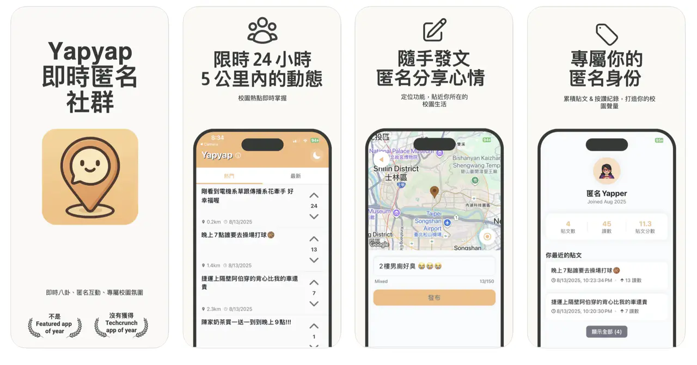

# Yapyap 📱

Yapyap is a side project I built over the summer.
It started as an attempt to **recreate the vibe of YikYak (a popular anonymous app in the U.S.)**, but redesigned and localized for students in Taiwan.

The idea is simple:

- 📍 Posts are only visible to people within a 5 km radius
- 💬 Share gossip, ask questions, find activities, or just vent freely
- 🙈 100% anonymous — no real identity required

  

---

## 📈 Milestone

- 🚀 Uploaded to the Apple App Store
- 🎉 Reached **#90 in the Social Media category** shortly after launch

  
  

---

## 🌏 Why Yapyap?

Taiwan doesn’t really have a hyper-local, anonymous, location-based community app.
Most platforms (like IG, FB, or Dcard) are either identity-based or too broad.

Yapyap is meant to fill that gap:

- A lightweight, instant campus/community forum
- Local-only conversations
- A fun, pressure-free space to see what people _around you_ are saying

---

## 🔗 Download

👉 [App Store Link](https://apps.apple.com/tw/app/yapyap-%E5%8D%B3%E6%99%82%E5%8C%BF%E5%90%8D%E7%A4%BE%E7%BE%A4-%E9%99%90%E5%AE%9A-5-%E5%85%AC%E9%87%8C/id6751183691?l=en-GB)

---
